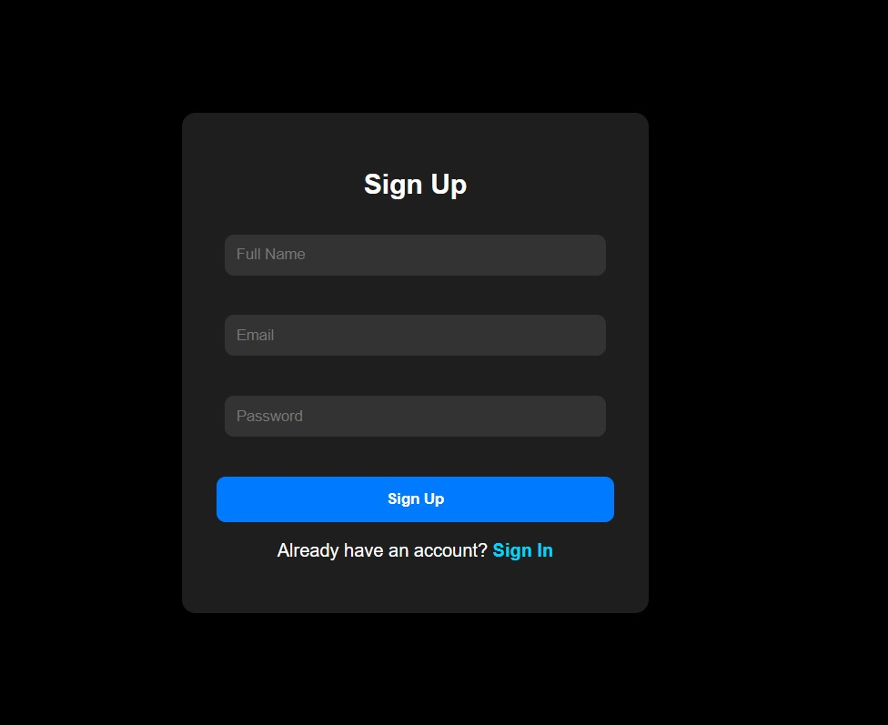
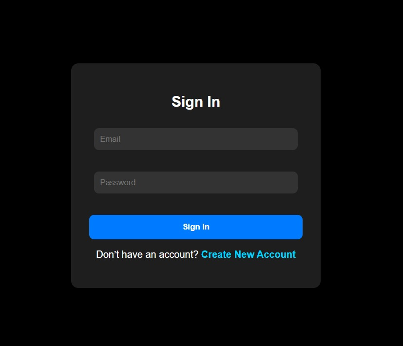

# 🔐 Authentication App - new

A sleek and modern React-based authentication application featuring **Sign In** and **Sign Up** pages.  
Designed with a responsive layout and customizable dark theme, this app provides a smooth user interface to demonstrate basic authentication flows.  

---

## ✨ Features
- 🔑 Sign In and Sign Up forms  
- 🎨 Dark theme styling  
- ⚡ Responsive UI with modern design  
- 🖥️ Built using **React.js**  
- 🚫 Works without a backend (for demo purposes)  

---

## 📸 Screenshots

<p align="center">
  
  
</p>


---

## 🛠️ Installation  

1. Clone the repository  
   ```bash
   git clone https://github.com/your-username/authentication-app.git
   cd authentication-app
